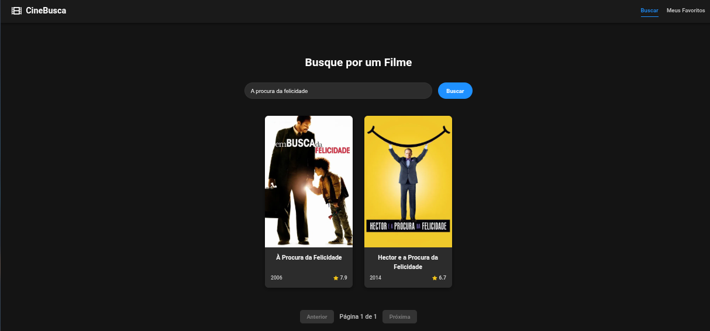
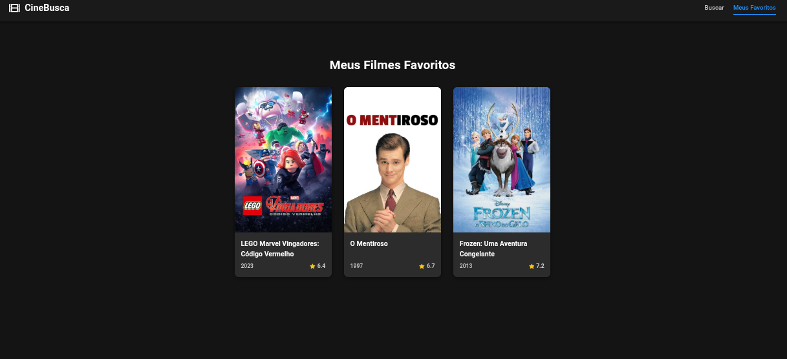
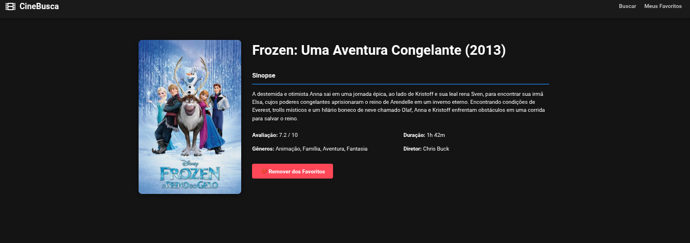

# 🎬 CineBusca

> Uma aplicação web desenvolvida com React para buscar informações sobre filmes, ver detalhes e criar uma lista de favoritos. O projeto consome a API do The Movie Database (TMDB) para obter dados atualizados sobre filmes.
> 

### ✨ Funcionalidades

- [x]  **Página de Busca**:
    - Campo de texto para buscar filmes por título.
    - Exibição dos resultados em uma grade de cards com pôster, título e ano.
- [x]  **Paginação**:
    - Navegação simples entre as páginas de resultados da busca.
- [x]  **Página de Detalhes**:
    - Visualização completa das informações de um filme, incluindo sinopse, avaliação, elenco, diretor e gêneros.
- [x]  **Lista de Favoritos**:
    - Botão para adicionar e remover filmes da lista de favoritos.
    - Os filmes favoritos são salvos localmente no navegador (`localStorage`), persistindo mesmo após fechar a página.
- [x]  **Interface Responsiva**:
    - Layout adaptável para uma boa experiência em dispositivos móveis, tablets e desktops.
- [x]  **Feedback ao Usuário**:
    - Indicadores de carregamento (`loading`) durante as buscas na API.
    - Mensagens de erro claras caso uma busca falhe ou não retorne resultados.

### 📸 Preview

*Busca de Filmes:*

*Filmes Favoritos:*

*Detalhes do Filme:*

### 🚀 Tecnologias Utilizadas

- **React.js**: Biblioteca principal para a construção da interface.
- **Vite**: Ferramenta de build para um desenvolvimento rápido.
- **React Router**: Para gerenciamento das rotas e navegação entre páginas.
- **Axios**: Para realizar as chamadas HTTP para a API do TMDB.
- **CSS puro**: Para estilização, com uso de Flexbox e Grid para layouts responsivos.
- **React Icons**: Para a inclusão de ícones na interface.

### 🛠️ Como Rodar o Projeto Localmente

Siga os passos abaixo para executar o projeto no seu ambiente de desenvolvimento.

**1. Clone o repositório**

`git clone https://github.com/seu-usuario/seu-repositorio.git`

**2. Navegue até a pasta do projeto**

`cd seu-repositorio`

**3. Instale as dependências**

`npm install`

**4. Configure as variáveis de ambiente**

- Crie um arquivo chamado `.env` na raiz do projeto.
- Dentro deste arquivo, adicione sua chave da API do TMDB, como no exemplo abaixo:

`VITE_API_KEY=SUA_CHAVE_DA_API_AQUI`

**5. Inicie o servidor de desenvolvimento**

`npm run dev`

Abra [http://localhost:5173](https://www.google.com/search?q=http://localhost:5173) (ou a URL que aparecer no seu terminal) para ver o projeto rodando.

### ✍️ Autor

Projeto desenvolvido por **Helen**.